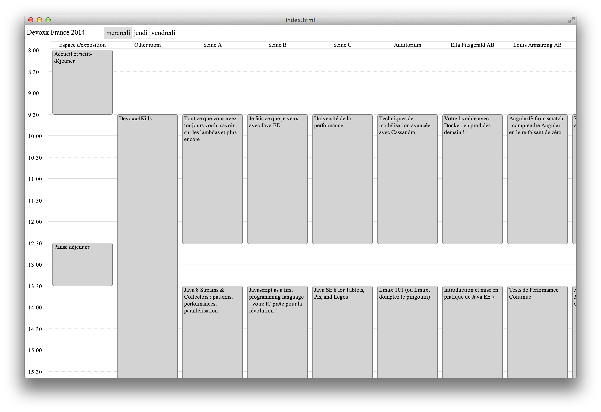

# ConferenceCalendar

Conference Calendar is a graphical view for Conferences Schedules.

It currently supports Devoxx and Devoxx France.

## Features

- Displays a schedule day by day
- Tooltip with summary of the event
- Mark events by clicking on them.

## How to use it

### If you don't have Nodejs

- Download Node-webkit binary for your platform ([Node-Webkit repo](https://github.com/rogerwang/node-webkit))
- Zip the content of the src folder and name it *package.nw*
- Put this file in the same folder of the Node-Webkit binary.
- Launch the Node-Webkit binary.

### If you have Nodejs

- Download Node-webkit binary for your platform ([Node-Webkit repo](https://github.com/rogerwang/node-webkit))
- Run the following commands:

>  npm install  
>  grunt  

- You will get an *package.nw* file in the dist folder.
- Put this file in the same folder of the Node-Webkit binary.
- Launch the Node-Webkit binary.

## Todo

- Fetch data from Conference APIs instead of using a cached version.
- Add navigation between conferences
- Enhance the schedule view
- Host prebuilt binaries
- Automate the packaging